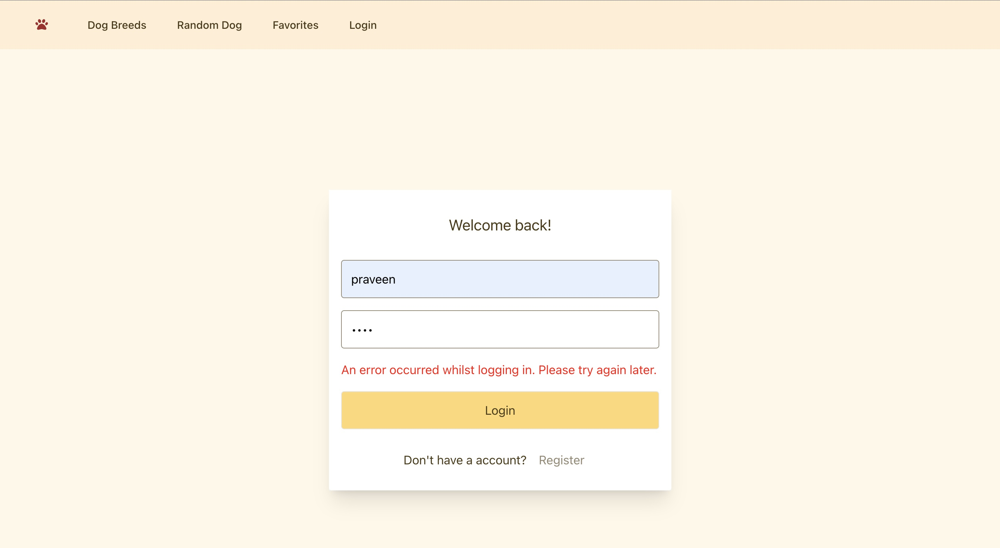
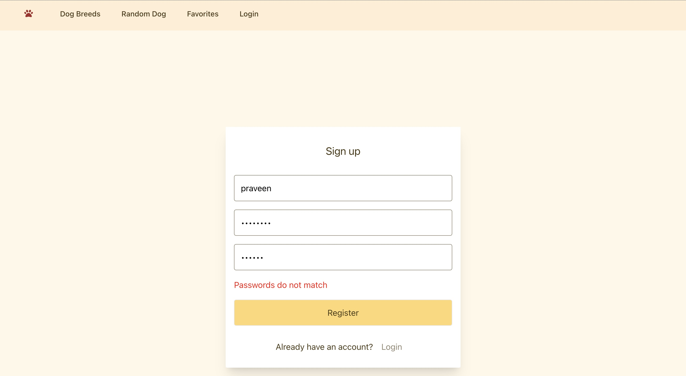
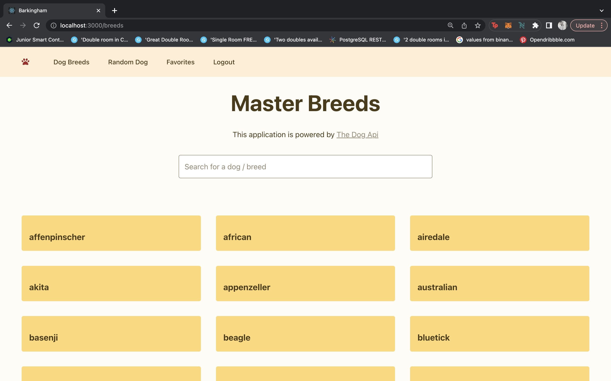
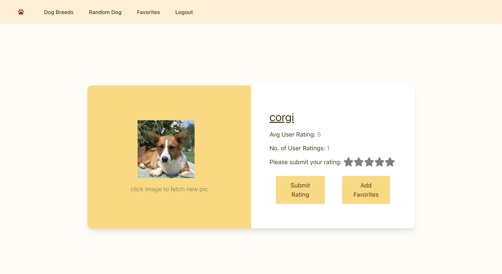

**Project: Barkingham Search Dogs App**

This repository contains a React JS application called Barkingham Search Dogs App which is designed to help dog lovers find their favorite breeds easily. It allows users to search for different dog breeds that are available in the dog.ceo API. Users can create an account and once they're authenticated, they can rate and add dogs to their favorites list. Additionally, there's a page that randomly generates a dog when the user clicks on the dog image.

I've implemented Passport.js for user authentication in this application, which enables the storage of the user's session in MongoDB once they have successfully logged in. This ensures that the user stays logged in even when the browser is refreshed or closed. The application uses the React Router DOM to handle routing and the context system to share the authenticated state between components. Also for the backend, I used MongoDB for handling the user's data, such as checkAuthenticated and logout actions.

In terms of styling, I used Tailwind CSS to create a visually pleasing and consistent design throughout the application.

To provide the best performance for the application, I used MongoDB's aggregation pipeline for filtering and aggregating data on the server-side, rather than relying on computation on the client-side. This approach allows for efficient querying of the data and improved scalability.

Kindly find attached some notes on the thought process behind component design and best practices.

### Landing Page Login

### Register

### Search Breeds

### Random Dog Generator

## Prerequisite

- To use this application, you will need to have a MongoDB Atlas account and create a .env file in the backend folder with the following configuration:
  - ATLAS_USER: your MongoDB Atlas username
  - ATLAS_PASSWORD: your MongoDB Atlas password
  - SESSION_SECRET: a secret string used for encrypting session information

The above configuration ensures that the application can establish a connection to your MongoDB Atlas cluster and perform database interactions.

## Upcoming Features

- To provide clear feedback to the user, notifications will be implemented throughout the application in the event of a database interaction via an API call to MongoDB.
- To enhance the user experience, a "Remove from favorites" button will be added to the list of dog cards displayed in the Favorites page.
- A drop-down filter added to the Search Breeds page will allow users to view dogs based on the average weighted rating from all users. This would allow them to filter and see which dogs have the highest or lowest ratings according to the users who used the app before. It will enhance the user experience by providing more control to the user and allow them to quickly filter and find the breeds they want based on rating criteria. (The backend implementation for this feature has already been completed).
- To optimize the architecture of the application and improve maintainability, an investigation will be made to determine whether the Single Dog component can leverage the context API for data management, rather than relying on props passed from the Random Dog Generator and View Specific dog breeds pages.
- To address an issue with the navigation bar, a fix will be implemented to ensure that the logout button is consistently displayed when the user is logged in, even after the browser is refreshed. Currently for a brief moment, the login button is displayed when the page is refreshed.
